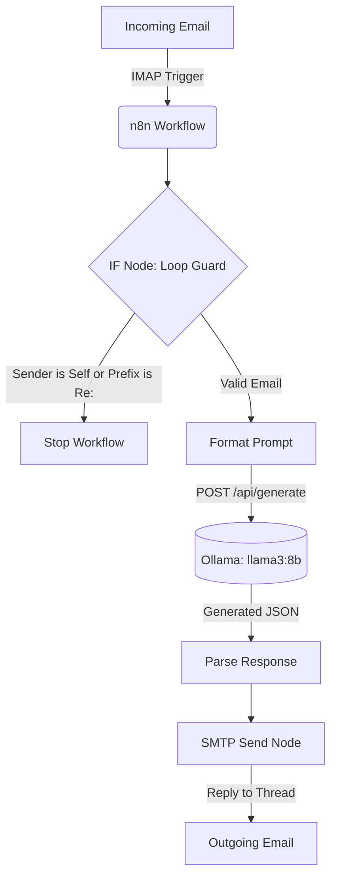

# Local AI Email Auto-Responder

A fully local, privacy-preserving AI email auto-responder built with **n8n** and **Ollama**. This project intelligently reads incoming emails, processes their intent using a locally hosted Large Language Model (`llama3:8b`), and automatically generates and sends contextually relevant replies—all without your data ever leaving your machine.

---

## 🏗 Architecture & Data Flow

The system runs entirely via Docker Compose, bridging an email server with a local LLM through an automated pipeline. 

**High-Level Data Flow:**
`IMAP Trigger` → `IF Loop Guard` → `HTTP Request (Ollama)` → `Parse & Thread` → `SMTP Send`



---

## ⚙️ Workflow Internals

The core logic is contained in `workflow.json`, which consists of four primary nodes:

1. **Email Read (IMAP) Trigger**: Connects to the configured INBOX and triggers execution only on `UNSEEN` messages.
2. **IF Node (Loop Prevention)**: Evaluates incoming emails against `$env["MY_EMAIL_ADDRESS"]` to ensure the bot doesn't reply to itself. It also checks if the subject starts with `Re: ` to avoid infinite auto-reply loops.
3. **HTTP Request (Ollama)**: Dynamically constructs a JSON payload and makes a POST request to `http://ollama:11434/api/generate`. 
   - *Example Prompt Structure*:
     ```json
     {
       "model": "llama3:8b",
       "stream": false,
       "prompt": "You are a helpful assistant. A new email has arrived from {{ $json.from.address }}. The subject is '{{ $json.subject }}'. The body is: \n\n{{ $json.text }}.\n\nPlease write a suitable reply. Only provide the reply body, without any greeting or signature."
     }
     ```
4. **Send Email (SMTP)**: Takes the AI's generated reply from `{{ $node["HTTP Request (Ollama)"].json.response }}`. Crucially, it passes the original `{{ $json.messageId }}` into the email headers to maintain standard conversation threading (In-Reply-To/References).

---

## ✅ Requirement Mapping

This project strictly adheres to the technical specification requirements:

| Requirement | Implementation |
| :--- | :--- |
| **Docker Compose** | `docker-compose.yml` defines `n8n` & `ollama` with isolated `ai_responder_net`, volumes, and healthchecks. |
| **Model Availability** | `Dockerfile.ollama` extends the base image to pre-bake and automatically pull `llama3:8b` on startup. |
| **IMAP Trigger** | `workflow.json` begins with `n8n-nodes-base.emailReadImap`. |
| **HTTP POST to Ollama** | `workflow.json` uses `n8n-nodes-base.httpRequest` to POST to `http://ollama:11434/api/generate`. |
| **Dynamic Prompt** | Expressions `{{ $json.subject }}` and `{{ $json.text }}` dynamically inject email context into the LLM prompt. |
| **Response Parsing** | The SMTP node maps the body to `{{ $node["HTTP Request (Ollama)"].json.response }}`. |
| **SMTP Send & Threading** | `n8n-nodes-base.emailSend` utilizes `{{ $json.messageId }}` for the threading headers. |
| **Loop Prevention** | `n8n-nodes-base.if` verifies `$env["MY_EMAIL_ADDRESS"]` and subject prefixes. |
| **Configuration** | `.env.example` documents all required IMAP/SMTP and workflow variables. |
| **Evaluation Data** | `submission.json` is structured for automated testing with real Ethereal credentials. |

---

## 🚀 Setup & Testing

### 1. Prerequisites
- Docker and Docker Compose installed.
- IMAP and SMTP credentials (e.g., Gmail App Password or Ethereal test account).

### 2. Environment Configuration
Copy the template and fill in your credentials:
```bash
cp .env.example .env
```
*Ensure `MY_EMAIL_ADDRESS` matches the email you are using to prevent auto-reply loops.*

### 3. Launch Services
```bash
docker-compose up -d --build
```
*(Note: The initial build pulls the `llama3:8b` model (~4.7GB), which may take a few minutes).*

### 4. Import & Activate
1. Open the n8n UI at [http://localhost:5678](http://localhost:5678).
2. Create your owner account if running for the first time.
3. Click **Workflows** → **Add Workflow** → **Options (three dots)** → **Import from File**.
4. Select `workflow.json` from this repository.
5. Toggle the workflow to **Active**.

### 5. Verification
- Send a test email from a different account to your configured INBOX.
- Watch the **Executions** tab in n8n to see the data flow through the nodes.
- Check your sending account to verify the AI-generated reply arrived perfectly threaded.

---

## 🛠 Customization & Future Improvements

- **Adjusting the Persona:** You can easily change the bot's tone (e.g., strictly professional vs. casual) by modifying the `prompt` string in the HTTP Request node inside n8n.
- **Whitelist/Blacklist Routing:** An additional IF node can be placed before the LLM request to restrict replies only to certain domains or VIP contacts.
- **Label-Based Processing:** Future iterations could filter the IMAP trigger to only process emails moved to a specific "Ask AI" folder to save compute resources.
